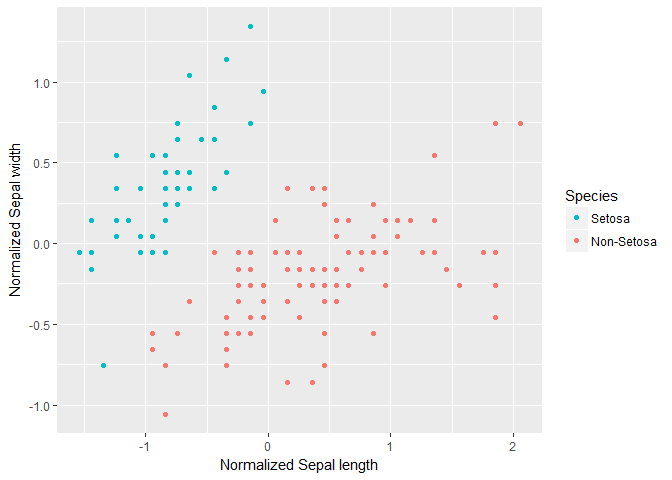
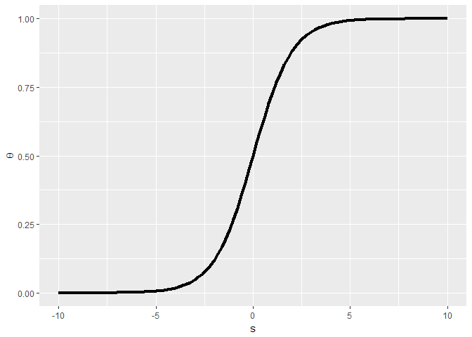
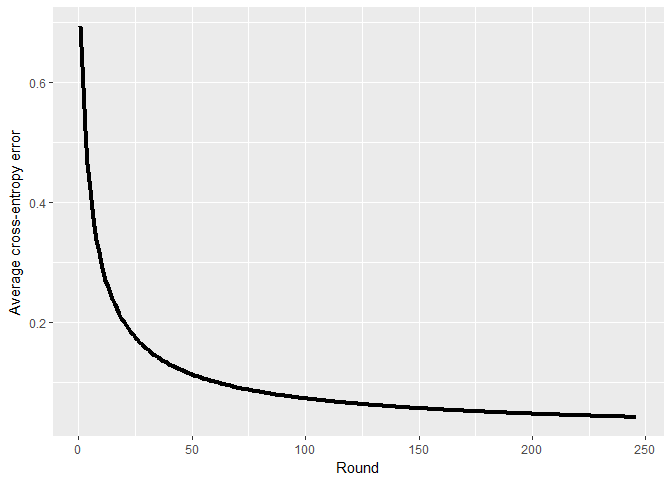

Building a logistic regression model
================

In this document, I will build a logistic regression model from scratch and use it for binary classification on the iris data set.

Preparing the data
------------------

The iris data set includes the length and the width of the petals and sepals of three different species of iris. For the binary classification here, I will only need two of the four features- sepal length and sepal width.

``` r
library(dplyr)
library(ggplot2)
data(iris)
D <- iris %>% select(-c(Petal.Length,Petal.Width))
```

A quick summary table shows that the three species of iris differ in the average length and width of their sepal.

``` r
D %>% group_by(Species) %>% summarize(meanSepal.L= mean(Sepal.Length),meanSepal.W= mean(Sepal.Width))
```

    ## # A tibble: 3 × 3
    ##      Species meanSepal.L meanSepal.W
    ##       <fctr>       <dbl>       <dbl>
    ## 1     setosa       5.006       3.428
    ## 2 versicolor       5.936       2.770
    ## 3  virginica       6.588       2.974

Before going on with the logistic regression, I first normalize the two features and add an intercept to each observation. Since I am doing binary classification, I label the output of iris who belong to the Setosa class as +1 and those who do not (Versicolors and Virginicas) as -1.

``` r
X <- as.matrix(D  %>% mutate(Sepal.L.Norm = Sepal.Length-mean(Sepal.Length),
                             Sepal.W.Norm=Sepal.Width-mean(Sepal.Width),intercept=1)%>%
                 select(-c(Species,Sepal.Length,Sepal.Width))) 
Y <- ifelse(D$Species=="setosa",1,-1)
```

Here is what the data look like:

``` r
ggplot(as.data.frame(X),aes(Sepal.L.Norm,Sepal.W.Norm,color=as.factor(Y)))+
  geom_point()+ 
  xlab("Normalized Sepal length")+
  ylab("Normalized Sepal width")+
  scale_colour_discrete(name="Species",
                            breaks=c(1,-1),
                            labels=c("Setosa","Non-Setosa")) 
```



Logistic regression
-------------------

Essentially, what the logistic regression does is passing a signal, \(s\), which is the result of the dot product of a vector \(x\) composed of the features of the observations and a vector of weights \(w\), through a logistic function, theta, defined as : \(theta(s) = e^s/(1+e^s)\).

As shown by the graph below, the output of the logistic function is bounded between 0 and 1. The output has a probabilistic interpretation of being the probability that a given observation belongs to a given class.

``` r
ggplot(data.frame(x=c(-10,10)), aes(x)) +
  stat_function(fun=function(x){exp(x)/(1+exp(x))}, geom="line", size=1.5)+
  xlab("s")+ylab(expression(theta))
```



The algorithm employed to find the optimal weights vector is the gradient descent, which consists of updating the weights vector to the opposite direction of the gradient of the cost function. The cost function used is the cross-entropy error function.

Here, I'm using the stochastic version of gradient descent. Instead of computing the gradient with regards to all observations and taking the average to update the weights vector, I randomly choose one observation at a time and update directly the weights vector by the gradient with regards to this observation.

Unlike with the perceptron on linearly separable data where the algorithm stops automatically when there is no more misclassified data, here, a stop condition needs be defined for the algorithm. I will tell the algorithm to stop when the variation (Euclidean distance) between the resulting weights vector of the present round and the weights vector from the last round is smaller than a threshold.

In the following codes, I define functions that I will use to calculate the cross-entropy error, its gradient and the Euclidean distance between two weights vectors.

``` r
## Function
# Cross-entropy error
E <- function(x,y,z) 
{
  log(1+exp(-y%*%z%*%x))
}
# Gradient 
grad <- function(x,y,z)
{
  (-y%*%x)/c(exp(y%*%z%*%x)+1)
}
# Function to calculate Euclidean distance
norm_vec <- function(x) sqrt(sum(x^2))
```

To start the algorithm, I initialize the weights vector to all zeros and set the parameters to desired values. The two parameters that have to set are the rate at which the weights vector is updated and the threshold of variation of the weights vector below which the algorithm should stop.

``` r
## Parameter
rate <- 0.01
thres <- 0.01
## Initialization
w <- rep(0,ncol(X))
w.vec <- NULL
w.vec <- rbind(w.vec,w)
e <- NULL
e.vec <- NULL
epoch <- 1
w.var <-1 

while (w.var>=thres)
{
  for (i in 1 : nrow(X))
  {
    e[i] <- E(X[i,],Y[i],w.vec[epoch,])
  }
  e.vec <- rbind(e.vec,mean(e))
  
  seq <-sample(c(1:nrow(X)),nrow(X),replace=F)
  for (i in 1:100) 
  {
    gradient <- grad(X[seq[i],],Y[seq[i]],w)
    w <- w -rate%*%gradient
  }
  w.vec <- rbind(w.vec,w)
  epoch = epoch+1
  w.var <-norm_vec(w.vec[epoch-1,]-w.vec[epoch,])
  
}
```

Result
------

The following graph shows the decrease of the mean cross-entropy error of over rounds.

``` r
GraphD <- data.frame(Round=seq(1,nrow(e.vec)),Error= e.vec)
ggplot(GraphD,aes(Round,Error))+
  geom_line(size=1.5)+
  ylab("Average cross-entropy error")
```



Using the final weights vector obtained from the algorithm, I compute the signal for every observation and decide that a given observation is a Setosa if the logistic function on its signal results in a value that is greater than 0.5. In probabilistic terms, this means that the probability that the given observation is Setosa is greater than 0.5. By doing so, I successfully distinguished all the Setosas from the Non-Setosas in the training data. This shows that the algorithm that I built is working correctly.

``` r
Y.sig <- exp(X %*% t(w))/(1+exp(X%*%t(w)))
Y.predict <- ifelse(Y.sig >0.5,1,-1)
length(which(Y.predict != Y)) ## zero misclassified observation
```

    ## [1] 0
