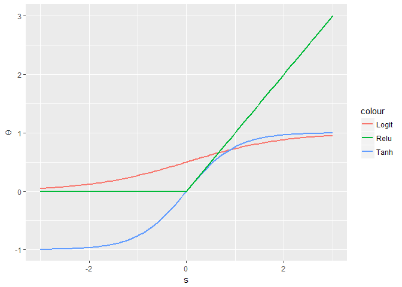

Building a neural network
================

In this document, I will build a simple neural network from scratch and test it on the same glass identification data set that I used in the other document on the nnet package. I will therefore cut short the description of the data set and jump directly to the neural network.

### The structure

Neural network is essentially a model composed out of multiple layers of units (neurons) interconnected by differents weights. The first layer of the network is the input layer. The units in this layer are the features of the data. A linear combination of the units of the input layer and a set of weights plus an intercept make up the signals and become the inputs of the next layer, the hidden layer. It is possible for the signals to go through different transformation functions. The three most popular choices are the logit function, the hyperbolic tangent function (tanh) and the rectified linear unit function (relu). Here is what these three functions look like :

``` r
library(ggplot2)
```

    ## Warning: package 'ggplot2' was built under R version 3.2.5

``` r
ggplot(data.frame(x=c(-3,3)), aes(x)) +
  stat_function(fun=function(x){exp(x)/(1+exp(x))}, geom="line", size=1,aes(color="Logit"))+
  stat_function(fun=function(x){tanh(x)}, geom="line", size=1,aes(color="Tanh"))+
  stat_function(fun=function(x){ifelse(x>0,x,0)}, geom="line", size=1,aes(color="Relu"))+
  xlab("s")+ylab(expression(theta))
```



Logit function bounds the value between 0 and 1. Tanh bounds the value between -1 and 1. For relu, the value is x for x larger than 0 and 0 otherwise.

The transformed signals are the outputs of the first hidden layer which are, again, multiplied by some weights, summed up with an intercept and passed to the next hidden layer as inputs. The same process repeats until the output layer where the signals are transformed according to the desired outcome type. For regression, the signals are left without transformation. For classification, the signals go through some kinds of sigmoid function.

I am going to build a neural network for multiclass classification so my output layer will be the same softmax classifier as the one I built for softmax regression. In the following codes, I load the data, create a dummy response variable for each output class and specify the number of units in the hidden layer. Here, I am using only one hidden layer with 20 units. With the number of input and output dictated by the data and the number of layer and hidden units decided, I now know exactly how many weights I need in this model. Note that in neural network, instead of initializing the weights to 0, we have to initialize them to some random small numbers.

``` r
library(dplyr)
## Data
data <- read.table("C:/Users/client/Desktop/data/glass.data",dec=".",sep=",")
X_1 <- data %>% select(-c(V1,V2,V11)) %>%
  apply(2,FUN=function(column){return((column-mean(column))/sd(column))} )
n_data <- nrow(X_1)
n_input <- ncol(X_1)
Y_type <- unique(data$V11)

## Parameter
n_output <- length(Y_type)
data$V11 <- as.factor(data$V11)
Y <- model.matrix(~data$V11-1,data=data)
# model
rate <-0.06
n_hidden <- 20

## Initialize
W_1 <- matrix(rnorm(n_input*n_hidden,0,0.01),nrow=n_input,ncol=n_hidden)
b_1 <- matrix(0,nrow=1,ncol=n_hidden)

W_2 <- matrix(rnorm(n_hidden*n_output,0,0.01),nrow=n_hidden,ncol=n_output)
b_2 <- matrix(0,nrow=1,ncol=n_output)

run <- 0
evec <- NULL
```

### The flow

The algorithm that makesneural network running consists of two parts- forward propagation and backward propagation. In forward propagation, we compute the signals, the transformations and the final outputs. In backward propagation, we compute the gradients of the error function with respect to the weights in every layer. Once the gradients are computed, we can update the weights to lower the error and optimize the model. The more tricky part of the algorithm is to compute the gradients. This has to be done in two steps. First, we compute the "sensitivity" of the error to the signals. Then, we multiply the sensitivity by the inputs of the former layer to obtain the gradients. More details on the mathematics can be found in the chapter on neural network in the excellent introductory machine learning textbook [Learning From Data](http://amlbook.com/).

``` r
while(run < 35000)
{
# Forward propagation
signal_1 <- sweep(X_1 %*% W_1, 2, b_1,"+")
X_2 <- pmax(signal_1,0)
  
signal_2 <- sweep(X_2 %*% W_2, 2, b_2,"+")
signal_2 <- exp(signal_2)
X_3 <- sweep(signal_2,1,rowSums(signal_2),"/")

e <- -colSums(log(X_3) * Y)
e <- sum(e)
evec <- rbind(evec,e)

# Backward propagation
delta_2 <- X_3-Y
delta_2 <- delta_2/n_data
delta_1 <- delta_2 %*% t(W_2)
delta_1[X_2 <= 0] <- 0

gradient_W2 <- t(X_2) %*% delta_2
gradient_b2 <- colSums(delta_2)

gradient_W1 <- t(X_1) %*% delta_1
gradient_b1 <- colSums(delta_1)

# Update
W_2 <- W_2 - rate*gradient_W2
b_2 <- b_2- rate*gradient_b2

W_1 <- W_1 - rate*gradient_W1
b_1 <- b_1- rate*gradient_b1

run <- run +1
}
```

After many iterations, the final hypothesis attains an in-sample accuracy above 95% on the glass data set. This is a very simple neural network and there is still plenty of room for improvement. For example, I should try using some advanced versions of gradient descent to make the optimization process more efficient so that the model will require fewer iterations. Note that if we are really to use the model for prediction, we will also have to add some regularizers to the error function to prevent overfitting.

``` r
signal_2 <- sweep(X_2 %*% W_2, 2, b_2,"+")
signal_2 <- exp(signal_2)
X_3 <- sweep(signal_2,1,rowSums(signal_2),"/")
y.predict <- apply(X_3, 1, function(row){Y_type[which.max(row)]})
length(which(y.predict==data$V11))/n_data
```

    ## [1] 0.9626168

Reference
---------

-   Yaser S. Abu-Mostafa, Malik Magdon-Ismail, Hsuan-Tien Lin (2012). Learning From Data. eChapter 7. AMLBook.
