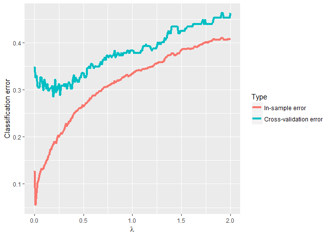
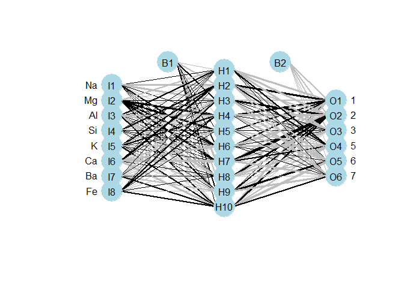

Neural network classification with nnet package
================

In this document, I will use a readily available neural network package in R, **nnet**, to classify different types of glass according to their chemical composition. The emphasis of this document will be the usage of the package and the choice of its parameters through cross-validation. More details on the neural network itself can be found in the other markdown document in the same repository in which I will build a neural network from scratch myself.

Data
----

The glass identification data set used here can be found on the [UCI Machine Learning Repository](https://archive.ics.uci.edu/ml/datasets/Glass+Identification). The data set contains the weight percentage of 8 chemical elements (Na, Mg, Al, Si, K, Ca, Ba, Fe) in 7 types of glass :

1.  building\_windows\_float\_processed
2.  building\_windows\_non\_float\_processed
3.  vehicle\_windows\_float\_processed
4.  vehicle\_windows\_non\_float\_processed (zero observation in this data set)
5.  containers
6.  tableware
7.  headlamps

``` r
library(dplyr)
library(plotly)
library(reshape2)
library(RColorBrewer)
library(ggplot2)
data <- read.table("C:/Users/client/Desktop/data/glass.data",dec=".",sep=",")
names(data) <- c("ID","RI","Na","Mg","Al","Si","K","Ca","Ba","Fe","Type")
data$Type <- as.factor(data$Type)
```

Here are the number of observations of each type of glass in the data set :

``` r
table(data$Type)
```

    ## 
    ##  1  2  3  5  6  7 
    ## 70 76 17 13  9 29

The following graph shows the average weight percentage of the 8 chemical elements in the 6 types of glass that are present in the data set.

``` r
Graphbar<- data %>% select(-c(ID,RI))%>% melt("Type",variable.name="Chemical",value.name="value")%>%
  group_by(Type,Chemical) %>% 
  summarize(meanvalue = mean(value))

Graphbar$Chemical <- factor(Graphbar$Chemical, levels = rev(levels(Graphbar$Chemical)))

ggplot(Graphbar,aes(x=Type,y=meanvalue,fill= Chemical))+
  geom_bar(stat="identity")+
  scale_fill_brewer(palette="BrBG")+
  xlab("")+ylab("%")
```


Neural network
--------------

### nnet function

To begin, I create a features matrix \(X\) that contains the normalized weight percentage of the eight chemicals. I also need one dummy response variable for each type of glass. This can be done easily with the help the **class.ind** function in the package.

``` r
library(nnet)
X <- data %>% select(-c(ID,RI,Type)) %>% 
  apply(2,FUN=function(column){return((column-mean(column))/sd(column))} )
Y <- class.ind(data$Type)
```

**nnet** is the function to use to train neural networks in the package. It takes as necessary arguments a X matrix (or data frame), a Y matrix (or data frame) and the number of units in the hidden layer. Other optional arguments that we can pass to the function includes the range within which the weights are to be randomly initialized, the weight decay parameter, the maximum number of iterations and whether the model should be fixed according to least-squares error or entropy error.

Some rules of thumb can help us decide on the value of these parameters. For example, the number of hidden units should be around the square root of the number of observations. We can also use cross-validation to select an optimal value for these parameters. This is what I am going to do with the weight decay parameter.

### Cross-validation

To perform cross-validation, we need to partition the data into a number of same-sized subsets and keep one subset out of the training process for validation at each iteration. The cross-validation error is obtained by averaging the validation error at each iteration. Here, I choose to partition the data into 10 subsets. The resulting cross-validation is called 10-fold cross-validation. I use the 10-fold cross-validation to select a value for the weight decay parameter from the range of 0 to 2 which results in the lowest cross-validation error.

``` r
## Parameter
fold <- 10
val_s <- floor(nrow(data)/fold)
val_permut <- sample(nrow(data),nrow(data),replace=F)
val <- seq(1,214,by=val_s)
lambda <-seq(0,2,by=0.01)

## Initialize vectors
Ein <- NULL
Ecv <- NULL
Ein_temp <- NULL
Ecv_temp <- NULL

## Cross validation
for (i in 1:length(lambda)){
for (j in 1: fold){
if (j < 10)
{val_index <-val_permut[val[j]:(val[j+1]-1)] }
else
{val_index <- val_permut[val[j]:nrow(X)]}
set.seed(2)
nnglass <- nnet(X[-val_index,], Y[-val_index,], size =10, rang = 0.1,
                decay =lambda[i], maxit = 1000,entropy = T,trace=F)
# In-sample error
y_pred<- predict(nnglass,X[-val_index,])
y_pred <- apply(y_pred,1,function(row){colnames(y_pred)[which.max(row)]})
Ein_temp[j] <- length(which(data$Type[-val_index]!= y_pred))/length(data$Type[-val_index])
# Cross-validation error
y_pred<- predict(nnglass,X[val_index,])
y_pred <- apply(y_pred,1,function(row){colnames(y_pred)[which.max(row)]})
Ecv_temp[j] <-length(which(data$Type[val_index]!= y_pred))/length(data$Type[val_index])
}
Ein[i] <- mean(Ein_temp)  
Ecv[i] <-mean(Ecv_temp)
}
```

The value of the weight decay parameter that results in the lowest cross-validation error turns out to be:

``` r
lambda[which.min(Ecv)]
```

    ## [1] 0.09

We can see from the following graph that the in-sample error (red line) increases as the weight decay parameter lambda gets larger. This is because what lambda does is essentially to constrain the extent to which the weights of the model can vary to capture the training data points. This results in a higher in-sample error. However, by constraining the variation of the weights, we can potentially obtain a better out-of-sample performance as shown by the decreasing cross-validation error (blue line) up to the optimal point when the cross-validation error is the lowest.

``` r
GraphD <- data.frame(Lambda=lambda,Ein= Ein, Ecv=Ecv)
GraphD <- melt(GraphD, id.vars="Lambda", value.name="Error", variable.name="Type")
GraphD$Type <- factor(GraphD$Type , levels=c("Ein", "Ecv"), labels=c("In-sample error","Cross-validation error"))

ggplot(GraphD,aes(x=Lambda,y=Error,group=Type,colour=Type))+
  geom_line(size=1.5)+
  ylab("Classification error")+ xlab(expression(lambda))
```



### Final hypothesis

Having decided the value of lambda to use, I train the model with all the observations in the data set and obtain the final hypothesis. The estimation of the out-of-sample of this model is the cross-validation error obtained earlier with the chosen lambda. Note that since we've deliberately chosen the best performer (lambda with the lowest cross-validation error), the cross-validation error is no longer an unbiased estimator of the out-of-sample error.

``` r
## Final hypothesis
nnglass <- nnet(X, Y, size =10, rang = 0.1,decay =lambda[which.min(Ecv)], maxit = 1000,entropy = T,trace=F)
min(Ecv)
```

    ## [1] 0.2860952

Made with a visualization tool created by Beck MW, the following graph shows the structure of the trained neural network which contains 8 inputs, 10 hidden units in 1 layer and 6 outputs.

``` r
library(devtools)
source_url('https://gist.githubusercontent.com/fawda123/7471137/raw/466c1474d0a505ff044412703516c34f1a4684a5/nnet_plot_update.r')
plot.nnet(nnglass)
```



Reference
---------

-   Lichman, M. (2013). [UCI Machine Learning Repository](http://archive.ics.uci.edu/ml). Irvine, CA: University of California, School of Information and Computer Science
-   Venables, W. N. & Ripley, B. D. (2002). Modern Applied Statistics with S. Fourth Edition. Springer, New York. ISBN 0-387-95457-0
-   Beck MW. (2015). NeuralNetTools: Visualization and Analysis Tools for Neural Networks. Version 1.3.7.
