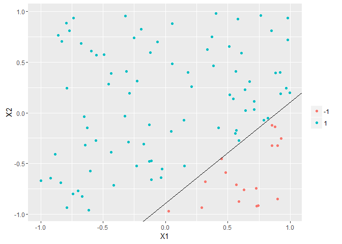
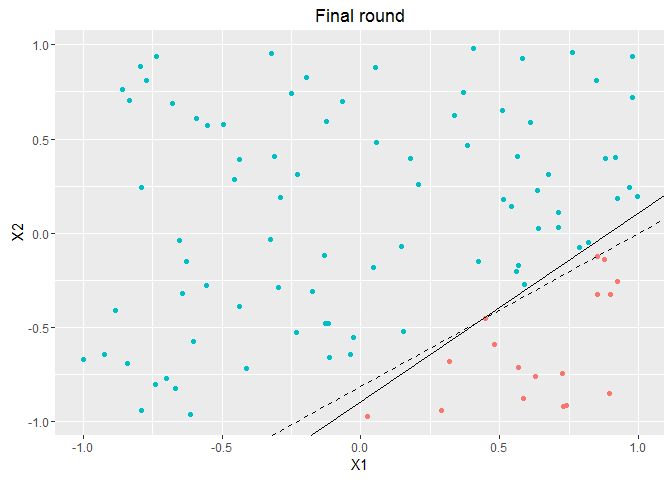
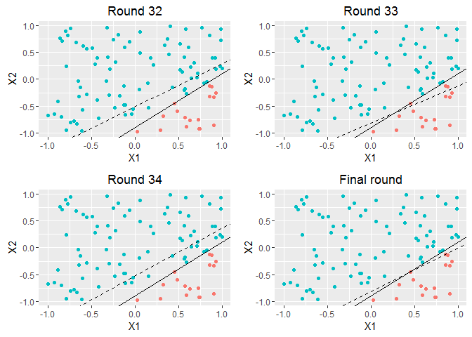

Perceptron
================

In this document, I will build a Perceptron Learning Algorithm (PLA) to classify some linearly separable 2D data.

Preparing the data
------------------

First, I randomly generate 100 data points with coordinates *\(x_1\)*, *\(x_2\)* and an intercept *\(x_0\)*. These are the data that I am going to use to train the model.

``` r
X1 <- runif(100,min=-1,max=1)
X2 <- runif(100,min=-1,max=1)
X0 <- rep(1,100)
X <- cbind(X0,X1,X2)
```

I then create a random line on the plane as the target function. Points above the line are labeled \(y= +1\) whereas those below are labeled \(y= -1\).

``` r
PX1 <-runif(2,min=-1,max=1)
PX2 <-runif(2,min=-1,max=1)
slope <- diff(PX2)/diff(PX2)
intercept <- PX2[1]-slope*PX1[1]
Y <- ifelse(X2>intercept+slope*X1,+1,-1)
X.plot <- as.data.frame(X) # dataframe for plot use
```

Here is what the data points and the target function look like on a 2D plane :

``` r
library(ggplot2)
ggplot(X.plot,aes(X.plot$X1,X.plot$X2))+
    geom_point(aes(color=as.factor(Y)),show.legend = T)+
    geom_abline(intercept = intercept,slope=slope)+
    labs(x="X1",y="X2",color="")
```



Hypothesis
----------

The hypothesis set of Perceptron assigns \(+1\) or \(-1\) to \(y\) according to the sign of the dot production of the vector \(x\) (containing *\(x_0\)*, *\(x_1\)*, *\(x_2\)*) and a weight vector \(w\) (containing *\(w_0\)*, *\(w_1\)*, *\(w_2\)*).

\(h(x) = sign(w^Tx)\)

PLA
---

The goal of PLA is to find a set of optimal weights such that \(h(x)\) would correctly predict \(y\) for all the points in our training data.

To do so, the algorithm randomly picks a misclassified point \(n\) in each round and updates the weight vector by adding the product of the scalar \(y_{n}\) and the vector \(x_{n}\) to it.

\(w_{t+1} = w_t+ y_{n}x_{n}\)

By doing so, PLA rotates the weight vector \(w\) towards the misclassified point since \(w_{t+1}^Tx_n > w_t^Tx_n\).

These steps are repeated until all points are correctly classified.

``` r
## Initialize
w <- c(0,0,0)
count <- 0 # to count the number of rounds required
wdf <- NULL # df to collect the resulting weights of each round for plot use
Y_hat <- X %*% w
wdf <- rbind(wdf,w)
## Perceptron learning algorithm
while (any(sign(Y_hat)!=sign(Y)))
{
  miss_class <- which(sign(Y_hat)!=sign(Y))
  ifelse(length(miss_class)>1,n <- sample(miss_class,1),n <- miss_class)
  w <- w+(Y[n]%*% X[n,])
  wdf <- rbind(wdf,w)
  Y_hat <- X %*% t(w)
  count <- count+1
}
```

Result
------

The final weights obtained from the algorithm are shown below by the dashed line. They are close to the original target function :

``` r
drawplot <- function(n,name)
{
  if (!n %in% seq(1,count+1))
  {
    warning("Out of bounds")
  }
  else
  {
  int_w <- -wdf[n,1]/wdf[n,3]
  slope_w <- -wdf[n,2]/wdf[n,3]
  a <- ggplot(X.plot,aes(X.plot$X1,X.plot$X2))+
    geom_point(aes(color=as.factor(Y)),show.legend = F)+
    geom_abline(intercept = intercept,slope=slope)+
    geom_abline(intercept = int_w,slope=slope_w,linetype="dashed")+
    labs(x="X1",y="X2",color="",title=name)
  }
}
pf <- drawplot(count+1,"Final round")
pf
```



We can also see the resulting weights of the last four rounds :

``` r
library(gridExtra)
p1 <- drawplot(count-2,sprintf("Round %i",count-3))
p2 <- drawplot(count-1,sprintf("Round %i",count-2))
p3 <- drawplot(count,sprintf("Round %i",count-1))
grid.arrange(p1, p2,p3,pf,ncol=2)
```


