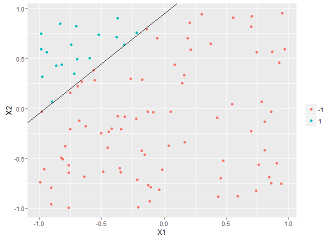
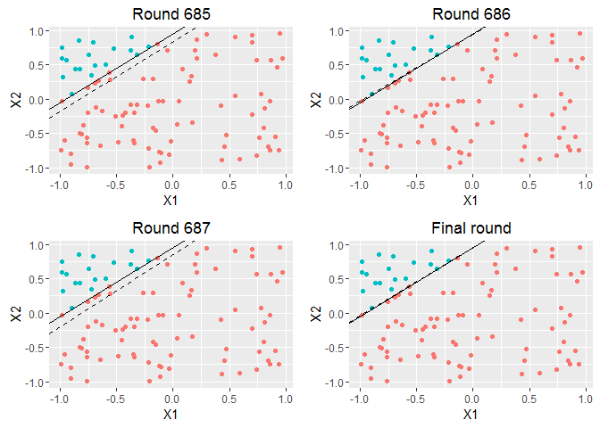

Perceptron Learning Algorithm
================

This document demonstrates the application of the Perceptron Learning Algorithm (PLA) to some linearly separable 2D data for the purpose of classification.

Preparing the data
------------------

First, we randomly generate 100 points with coordinates x1, x2 and an intercept x0 as our training data:

``` r
X1 <- runif(100,min=-1,max=1)
X2 <- runif(100,min=-1,max=1)
X0 <- rep(1,100)
X <- cbind(X0,X1,X2)
```

To classify these points, We find a random line on the plane and assign y to +1 for points above the line and -1 for those below.

``` r
PX1 <-runif(2,min=-1,max=1)
PX2 <-runif(2,min=-1,max=1)
slope <- diff(PX2)/diff(PX2)
intercept <- PX2[1]-slope*PX1[1]
Y <- ifelse(X2>intercept+slope*X1,+1,-1)
X.plot <- as.data.frame(X) # dataframe for plot use
```

The points and the seperating line look like the following :

``` r
library(ggplot2)
```

    ## Warning: package 'ggplot2' was built under R version 3.2.5

``` r
ggplot(X.plot,aes(X.plot$X1,X.plot$X2))+
    geom_point(aes(color=as.factor(Y)),show.legend = T)+
    geom_abline(intercept = intercept,slope=slope)+
    labs(x="X1",y="X2",color="")
```



PLA
---

### Training

PLA classfies a point according to the sign of dot product of the x vector of that point (x0,x1 , x2) and the weight vector (w0, w1, w2). The goal of PLA is to find a optimal weight vector such that sign(sum(wixi)) would correctly predict yi for all point i in our data. To do so, the algorithm randomly picks a misclassified point in each round and updates the weight vector by adding the product of the scalar yn and the vector xn to it. By doing so, PLA corrects the classification of the given point. These steps are repeated until all training points are correctly classified.

``` r
## Initialize
w <- c(0,0,0)
count <- 0 # to count the number of rounds required
wdf <- NULL # df to collect the resulting weights of each round for plot use
Y_hat <- X %*% w
wdf <- rbind(wdf,w)
## Perceptron learning algorithm
while (any(sign(Y_hat)!=sign(Y)))
{
  miss_class <- which(sign(Y_hat)!=sign(Y))
  ifelse(length(miss_class)>1,n <- sample(miss_class,1),n <- miss_class)
  w <- w+(Y[n]%*% X[n,])
  wdf <- rbind(wdf,w)
  Y_hat <- X %*% t(w)
  count <- count+1
}
```

The final weights of the trained model are shown below by the dashed line which is close to the original separating line :

``` r
drawplot <- function(n,name)
{
  if (!n %in% seq(1,count+1))
  {
    warning("Out of bounds")
  }
  else
  {
  int_w <- -wdf[n,1]/wdf[n,3]
  slope_w <- -wdf[n,2]/wdf[n,3]
  a <- ggplot(X.plot,aes(X.plot$X1,X.plot$X2))+
    geom_point(aes(color=as.factor(Y)),show.legend = F)+
    geom_abline(intercept = intercept,slope=slope)+
    geom_abline(intercept = int_w,slope=slope_w,linetype="dashed")+
    labs(x="X1",y="X2",color="",title=name)
  }
}
pf <- drawplot(count+1,"Final round")
pf
```


We can also see the resulting weights of the last four rounds :

``` r
library(gridExtra)
```

    ## Warning: package 'gridExtra' was built under R version 3.2.5

``` r
p1 <- drawplot(count-2,sprintf("Round %i",count-3))
p2 <- drawplot(count-1,sprintf("Round %i",count-2))
p3 <- drawplot(count,sprintf("Round %i",count-1))
grid.arrange(p1, p2,p3,pf,ncol=2)
```



### Training
