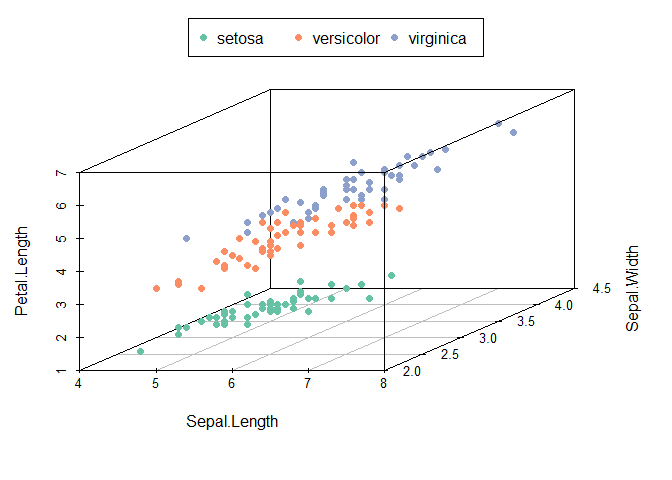

Building a softmax regression model
================

In this document, I will build a softmax regression model for multiclass classification. I will train this model on the iris data.

Data
----

Iris data set includes data on the length and width of the sepal and petal of three species of iris, Setosa, Versicolor and Virginica. The table below summarizes the average sepal length, sepal width, petal length and petal width of these three species.

``` r
library(dplyr)
iris %>% group_by(Species) %>% summarize(MeanSepal.L = mean(Sepal.Length),
                                      MeanSepal.W = mean(Sepal.Width),
                                      MeanPetal.L = mean(Petal.Length),
                                      MeanPetal.W = mean(Petal.Width))
```

    ## # A tibble: 3 × 5
    ##      Species MeanSepal.L MeanSepal.W MeanPetal.L MeanPetal.W
    ##       <fctr>       <dbl>       <dbl>       <dbl>       <dbl>
    ## 1     setosa       5.006       3.428       1.462       0.246
    ## 2 versicolor       5.936       2.770       4.260       1.326
    ## 3  virginica       6.588       2.974       5.552       2.026

Using the first three features as the x, y and z axes, we can see from the 3D scatter plot below that iris of the same species tend to be close to each other in these features. This means that we can possibly use these features to classify iris into one of the three species.

``` r
library(scatterplot3d)
library(RColorBrewer)

colors <- brewer.pal(3,name="Set2")
colors <- colors[as.numeric(iris$Species)]
scatterplot3d(iris[,1:3], pch = 16, color=colors,angle = 45)
legend("top", legend = levels(iris$Species),
       col =  brewer.pal(3,name="Set2"), pch = 16, 
       inset = -0.2, xpd = TRUE, horiz = TRUE)
```



The following codes normalize the four features that I will use to classify iris and create three response variables, one for each species, that take the value of \(1\) when an observation belongs to the species in question and 0 otherwise.

``` r
data_train  <- as.matrix(iris %>% mutate(intercept = 1,
               Sepal.L = (Sepal.Length-mean(Sepal.Length))/sd(Sepal.Length),
               Sepal.W = (Sepal.Width-mean(Sepal.Width))/sd(Sepal.Width),
               Petal.L = (Petal.Length-mean(Petal.Length))/sd(Petal.Length),
               Petal.W = (Petal.Width- mean(Petal.Width))/sd(Petal.Width))%>%
               select(-c(Species,Sepal.Length,Sepal.Width,Petal.Length,Petal.Width)))

y_train <- data.frame(setosa= iris$Species=="setosa",
                      versicolor= iris$Species=="versicolor",
                      virginica= iris$Species=="virginica")
```

Softmax regression
------------------

Softmax regression, also known as multinomial logistic regression, is a generalization of the logistic regression model for multiclass classification. The softmax classifier computes the probability that an observation \(n\) belongs to a given class \(i\) as a fraction between the exponential of the dot product of the features vector of the observation \(x_n\) and the weights vector of the class \(w_i\) and the sum of the exponential of the dot product between the features vector \(x_n\) and the weights vectors for all classes.

The codes below specify a function that computes the probability of an observation belonging to each class given the data and a set of weights for each class.

``` r
classprob <- function(x,w)
{
  signal<- x %*% t(w)
  signal <- exp(signal-apply(signal,1,function(row){return(max(row))}))
  return(sweep(signal,1,rowSums(signal),FUN= "/"))
}
```

The algorithm used to find the optimal set of weights for each class is mini batch gradient descent. The following codes compute the cost function of the softmax classifier and its gradient.

``` r
# calculate the cross-entropy error
compuerror <-function(x,y,w)
{
  prob <- classprob(x,w)
  E <- 0
  for ( j in 1:n)
  {
    E <- E-mean(y[,j]*log(prob[,j]))
  }
  return(E)
}
# calculate the gradient
compugrad <- function(x,y,w)
{
  prob <- classprob(x,w)
  for (j in 1:n) 
  {  
    gradient[j,] <- -colMeans(x*(y[,j]-prob[,j]))
  }
  return(gradient)
}
```

Mini batch gradient descent divides the data into multiple same sized mini batches, computes the gradient based on one batch a time and updates the weights accordingly. Mini batch gradient descent is a compromise between the efficiency of stochastic gradient descent and the stability of batch gradient descent.

The following codes specify the size of each mini batches, the rate at which the weights are updated and the threshold of the variation of error below which the algorithm should stop.

``` r
## Parameter
rate <- 0.1
batchs <- 10 # mini batch size
epsilon <- 10^-4
threshold <- 0.00001

batchl <- ceiling(nrow(data_train)/batchs)
n <- ncol(y_train)
f <- dim(data_train)[2]
```

To start the algorithm, I initialize all weights to zero and create an empty matrix to record the gradient that will be computed. With five inputs (four features plus one intercept) and three output (probability of an given observation belonging to each of the three classes), we need 3 sets of 5 weights. The gradient should therefore also has the same dimension.

``` r
## Initialization
w <- matrix(rep(0,f*n),ncol=f)
gradient <- matrix(rep(0,f*n),ncol=f)
Evec <- NULL
round<- 1
change <- 3
```

The following codes divide the data into mini batches, calculate the gradient based on one batch a time and update the weights.

The chunk of codes labeled "gradient check" checks whether the gradient computed is correct and stop the algorithm if it is not. It is useful to verify the gradient at the first round to make sure that there is no error in the way that we compute the gradient. However, it is not necessary to run these codes at every round since checking the gradient takes some extra run time.

``` r
## Algorithm
while(change>threshold)
{  
  for (i in 1:batchl)
  {
    if (i < batchl)
    {
      y_train_b <- y_train[((i-1)*batchs+1):(i*batchs),]
      data_train_b <- data_train[((i-1)*batchs+1):(i*batchs),]
    }
    else
    {
      y_train_b <- y_train[((i-1)*batchs+1):dim(data_train)[1],]
      data_train_b <- data_train[((i-1)*batchs+1):dim(data_train)[1],]
    }
    gradient <- compugrad(data_train_b,y_train_b,w) 
    
  ## gradient check
  if (round == 1)
  {
  check <- matrix(0,nrow=dim(gradient)[1],ncol=dim(gradient)[2])
  for (j in 1:dim(gradient)[1])
  {
    for (k in 1 :dim(gradient)[2])
    {
      w_plus <- w
      w_plus[j,k] <- w_plus[j,k]+epsilon
      E_plus <- compuerror(data_train_b,y_train_b,w_plus)  
      w_moins <- w
      w_moins[j,k] <- w_moins[j,k]-epsilon
      E_moins <- compuerror(data_train_b,y_train_b,w_moins)  
      check[j,k] <-abs(gradient[j,k]-(E_plus-E_moins)/(epsilon*2)) < epsilon
    }
  }
  if (mean(check)!=1)
  {break}
  }
  ## gradient check end  
    w <- w - rate*gradient
  }
  E <- compuerror(data_train,y_train,w)
  Evec <- rbind(Evec,E)
  if (round >1)
  {
    change <- abs(Evec[round,]-Evec[round-1,])
  }
  round <-round +1
}
```

Result
------

The following table summarizes the classification result using the final set of weights obtained from the algorithm. As can be seen from the table, the algorithm correctly classified all Setosas, misclassified two Versicolors as Virginicas and misclassified one Verginica as Versicolor. In other words, the model achieves an accuracy of 98% in-sample, which is a proof that it is working properly.

``` r
y_prob <- classprob(data_train,w)
listy <- unique(iris$Species)
y_hat <-  apply(y_prob,1, function(row){return(listy[which(row==max(row))])})
table(Data=iris$Species,Prediction=y_hat)
```

    ##             Prediction
    ## Data         setosa versicolor virginica
    ##   setosa         50          0         0
    ##   versicolor      0         48         2
    ##   virginica       0          1        49

``` r
length(which(y_hat==iris$Species))/nrow(iris) # Classification error
```

    ## [1] 0.98
