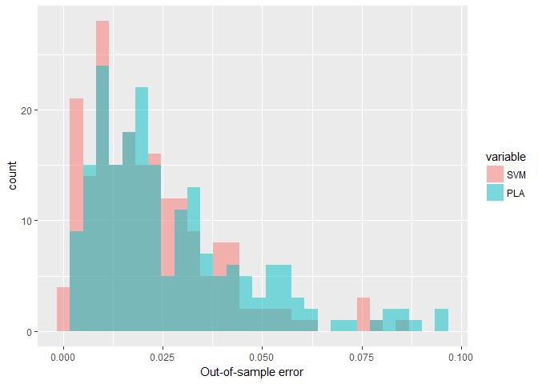

Linear hard margin support vector machine
================

In this document, I will build a linear hard-margin support vector machine (SVM) and compare its performance with perceptron learning algorithm (PLA) on some randomly generated 2D points. Linear hard margin SVM is the simplest form of SVM. The purpose here is to illustrate how this model works. In the another document, I will use the **svm** function available in the **e1071** package to perform some more advanced forms of svm (with kernels) on real data.

The idea of linear hard margin SVM is quite straight forward. Its goal is to find an optimal plane that separates the data with the largest margin. The margin of a separating plane is the distance between the plane and the data that is the closest to it. Hard-margin SVM assumes the data to be linearly separable whereas its soft-margin version allows the data to cross the separating plane SVM is basically a linear model. However, with some data transformations through kernels, the model can approximate some very complicated hyperplanes without paying the price of bad generalization.

The distance between a point \(x_n\) and the separating plane \(w^Tx+b=0\) can be calculated by projecting the distance between \(x_n\) and any \(x\) on the plane to the normalized unit vector \(w\) which is normal to the plane. If we normalize the absolute value of \(w^Tx+b\) for the \(x\) that is the closest to the plane to 1, the distance between this closest point and the plane equals the inverse of the norm of \(w\). Maximizing this quantity then becomes equivalent to minimizing \((1/2)*w^Tw\). The constraint that the absolute value of \(w^Tx+b\) for the closest \(x\) should be 1 can also be formulated as an equivalent inequality equation that \(y_n(w^Tx_n+b) >=1\) for all n. This then becomes a classic optimization problem that can be solved using quadratic programming. This can be done in R using the **solve.QP** function in the **quadprog** package. The mathematical details behind this be found in the chapter on SVM in [Learning From Data](http://amlbook.com/).

There are many arguments why a larger margin is better. These include the robustness to noises, better generalization ability and better performance out-of-sample performance. In the following codes, I generate some linearly separable 2D data and test the performance of trained PLA and SVM models for 200 rounds. Note that here, I'm solving the Lagrangian dual of the original optimization problem.

``` r
library(quadprog)
```

    ## Warning: package 'quadprog' was built under R version 3.2.5

``` r
Result <- NULL
Eout <- NULL
run <- 0
while(run < 200)
{
  repeat{
  ## Pick a line
  x1l <- runif(2,-1,1)
  x2l <- runif(2,-1,1)
  slopel <- diff(x2l )/diff(x1l)
  interceptl <- x2l[1]-slopel*x1l[1]
  ## Create training data
  n <- 50
  x1_tr <- runif(n,-1,1)
  x2_tr <- runif(n,-1,1)
  intercept_tr <- rep(1,n)
  data_tr<- cbind(intercept_tr,x1_tr,x2_tr)
  y_tr <- ifelse(x2_tr>interceptl+slopel*x1_tr,+1,-1)
  if(any(y_tr==1)&any(y_tr==-1))
  {break}
  }
  ## Create test data
  n_ts <- 10000
  x1_ts <- runif(n_ts,-1,1)
  x2_ts <- runif(n_ts,-1,1)
  intercept_ts <- rep(1,n_ts)
  data_ts <- cbind(intercept_ts,x1_ts,x2_ts)
  y_ts <- ifelse(x2_ts>interceptl+slopel*x1_ts,+1,-1)
  
  ## PLA training
  data_pla <- data_tr
  w_pla <- c(0,0,0)
  y_pla <- w_pla %*% t(data_pla)
  
  while (any(sign(y_pla)!=sign(y_tr)))
  {
    l <- which(sign(y_pla)!=sign(y_tr))
    ifelse(length(l)>1,choice <- sample(l,1),choice <- l)
    w_pla <- w_pla+(y_tr[choice]%*% data_pla[choice,])
    y_pla <- w_pla%*% t(data_pla)
  }
  ## PLA test
  pla_ts <- sign(w_pla%*% t(data_ts))
  PLA <-length(which(pla_ts!=y_ts))/n_ts 
  
  ## SVM training
  data_svm <- data_tr[,-1]
  M <- matrix(NA,nrow = n,ncol=n)
  for (i in 1:n)
  {for (j in 1:n)
  {
    M[i,j] <- y_tr[i]*y_tr[j]*(t(data_svm[i,])%*%data_svm[j,])
  }
  }
  d <- rep(1,n)
  A <- cbind(y_tr,diag(n))
  b <- rep(0,n+1)
  modification <- 1e-13
  M <- M + modification * diag(n)
  QP<-solve.QP(Dmat = M,  dvec = d,Amat=A,bvec=b,meq=1)
  alpha <- c(QP$solution)
  w_svm <- (QP$solution * y_tr)%*% data_svm
  sv <- which(QP$solution==max(QP$solution)) #pick the largest alpha to solve for b
  b <- y_tr[sv]-w_svm%*%data_svm[sv,]
  w_svm_f <- cbind(b,w_svm)
  
  # SVM test
  svm_ts<- sign(w_svm_f %*% t(data_ts))
  SVM <-length(which(svm_ts!=y_ts))/n_ts
  Eout <- rbind(Eout,cbind(SVM,PLA))
  run <- run +1
}
```

In 200 rounds, SVM achieved a lower out-of-sample error than PLA 60% of the time. This result comes to support that a larger margin indeed leads to a better performance.

``` r
Eout <- data.frame(Eout)
length(which(Eout$SVM<Eout$PLA))/nrow(Eout)
```

    ## [1] 0.64

The performance of the two model can be compared in the following graph:

``` r
library(ggplot2)
library(reshape2)
Eout <- melt(Eout)
ggplot(Eout, aes(value, fill = variable)) + 
  geom_histogram(alpha = 0.5, position = 'identity')+
  xlab("Out-of-sample error")
```



Reference
---------

-   Yaser S. Abu-Mostafa, Malik Magdon-Ismail, Hsuan-Tien Lin (2012). Learning From Data. eChapter 8. AMLBook.
