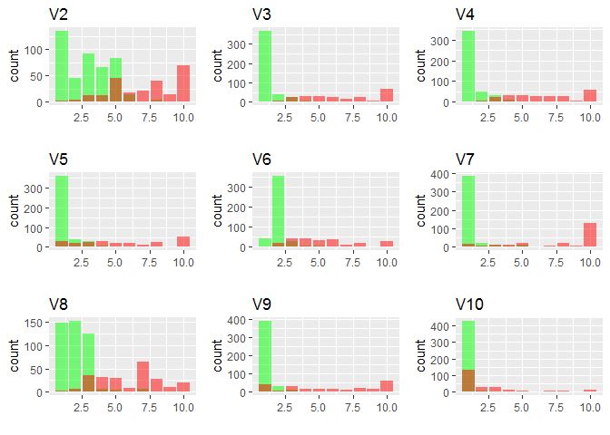

Predicting breast cancer with support vector machine
================

In this document, I will use the **tune.svm** and **svm** functions in the **e1071** package to predict breast cancer based on some attributes of breast cells. Instead of the simple linear hard-margin support vector machine (svm), I am going to use the soft-margin version coupled with some kernels. Kernels are specially designed functions that take the original data in the x space as inputs and output the inner product of some transformed x in the z space. Depending on the kernel used, the transformed x can be in a very complicated, even infinite-dimensional, z space.

The reason why we are interested in the inner product is because x only appears in the form of inner product in the SVM optimization equations. Therefore, if we are to replace the x in the original equation by its transformation, z, to allow the model to approximate more complicated planes, all we need to care about is the inner product of z.

Data
----

The data on breast cancer used here come from the [UCI Machine Learning Repository](https://archive.ics.uci.edu/ml/datasets/Breast+Cancer+Wisconsin+%28Original%29). This data set contains information on 9 attributes of breast cells and whether the cells are benign or malignant. The 9 attributes are:

-   Clump Thickness (V2)
-   Uniformity of Cell Size (V3)
-   Uniformity of Cell Shape (V4)
-   Marginal Adhesion (V5)
-   Single Epithelial Cell Size (V6)
-   Bare Nuclei (V7)
-   Bland Chromatin (V8)
-   Normal Nucleoli (V9)
-   Mitoses (V10)

All of these attributes are measured on a scale from 1 to 10.

V11 is the response variable with 2 for benign and 4 for malignant.

``` r
library(dplyr)
bcancer <- read.table("C:/Users/Client/Desktop/data/breast_cancer.data",sep=",",stringsAsFactors = F)
bcancer$V7 <- as.numeric(bcancer$V7)
bcancer <- bcancer[-which(is.na(bcancer$V7)),] #V7 contains some NA data
bcancer <- bcancer %>% select(-V1)# V1 is the sample code number
```

The number of observations in the two classes are the following:

``` r
bcancer %>% group_by(V11) %>% summarise(n())
```

    ## # A tibble: 2 × 2
    ##     V11 `n()`
    ##   <int> <int>
    ## 1     2   444
    ## 2     4   239

The following summary table shows that, on average, malignant breast cells have larger value on all of these attributes than the benign ones.

``` r
bcancer  %>% group_by(V11) %>% summarise_all(mean) %>%  glimpse()
```

    ## Observations: 2
    ## Variables: 10
    ## $ V11 <int> 2, 4
    ## $ V2  <dbl> 2.963964, 7.188285
    ## $ V3  <dbl> 1.306306, 6.577406
    ## $ V4  <dbl> 1.414414, 6.560669
    ## $ V5  <dbl> 1.346847, 5.585774
    ## $ V6  <dbl> 2.108108, 5.326360
    ## $ V7  <dbl> 1.346847, 7.627615
    ## $ V8  <dbl> 2.083333, 5.974895
    ## $ V9  <dbl> 1.261261, 5.857741
    ## $ V10 <dbl> 1.065315, 2.602510

These differences are shown by the following graphs where the malignant cells are represented by the red bars :

``` r
library(gridExtra)
library(ggplot2)
drawplot <- function(x){ggplot(bcancer,aes(bcancer[,x],fill=as.factor(V11)))+
  geom_bar(alpha = 0.5, position = 'identity')+
  scale_fill_manual(values  = c("green","red"),name="",guide=FALSE) +
  xlab("")+ggtitle(x)}

for (i in 1:9){
  local({
    j <-i 
    assign(paste0('p', i), drawplot(colnames(bcancer)[j]), pos = .GlobalEnv)
  })  
}
grid.arrange(p1, p2,p3,p4,p5,p6,p7,p8,p9,ncol=3)
```

 To prepare for the model, I label the malignant observations 1 and the benign ones -1. I then randomly sample 300 observations for training and leave the rest for testing.

``` r
x <- bcancer %>% select(-V11)
y <- ifelse(bcancer$V11==4,1,-1)
set.seed(4)
train <- sample(nrow(bcancer),300,replace=F)
```

SVM
---

The soft-margin SVM used here requires only a minor modification from the hard-margin SVM by adding an error penalty term to the original equation. As for the kernel, I will use a radial basis function (RBF) kernel. Both the error penalty term and the kernel require us to decide on the value of some parameters. For the error penalty term, it is the value of the penalty term (cost). For the RBF kernel, it is the value of the gamma in the function. **tune.svm** function in **e1017** can help us find the optimal value for these parameters based on cross-validation.

``` r
library(e1071)
tune.svm(x[train,],y[train],gamma=10^(-6:-1),cost=10^(1:4))
```

    ## 
    ## Parameter tuning of 'svm':
    ## 
    ## - sampling method: 10-fold cross validation 
    ## 
    ## - best parameters:
    ##  gamma cost
    ##   0.01   10
    ## 
    ## - best performance: 0.136664

Using the optimal values found by **tune.svm**, I train the model on the training data. Here is the in-sample accuracy.

``` r
model <- svm(x=x[train,],y=y[train],scale=FALSE,kernel="radial",
    type= "C-classification",gamma=0.01,cost=10)
y_in <-predict(model,x[train,])
length(which(y_in==y[train]))/length(y[train]) # in-sample accuracy
```

    ## [1] 0.99

I then test the trained model on the testing data. The out-of-sample accuracy is above 95%, which looks not bad at all at a first glance.

``` r
y_pred <- predict(model,x[-train,])
length(which(y_pred==y[-train]))/length(y[-train]) # out-of-sample accuracy
```

    ## [1] 0.9634465

However, if we look at the confusion matrix of the model, we can notice a worrying high false negative rate (malignant cells being predicted as benign). In the context of breast cancer, the consequence of this type error can be a lot more serious than the opposite case when a breast benign cell is predicted malignant and we should take this fact into account in our model.

``` r
table(predict=y_pred,diagnosis=y[-train])
```

    ##        diagnosis
    ## predict  -1   1
    ##      -1 249  11
    ##      1    3 120

**svm** function allows us to assign different weights to different classes fo data. This is useful when the data classes are unbalanced or when we have some reasons to be more concerned about one type of error than the other. To assign different weights, we simply need to add a **class.weights ** argument to the function.

``` r
model <- svm(x=x[train,],y=y[train],scale=FALSE,kernel="radial",
    type= "C-classification",gamma=0.01,cost=10 ,class.weights = c("1"=0.9,"-1"=0.1))
y_pred <- predict(model,x[-train,])
length(which(y_pred==y[-train]))/length(y[-train])
```

    ## [1] 0.9791123

``` r
table(predict=y_pred,diagnosis=y[-train])
```

    ##        diagnosis
    ## predict  -1   1
    ##      -1 244   0
    ##      1    8 131

Now this result looks better. As we really don't want to predict a breast cell as benign while it is actually malignant, I assign a weight of 0.9 to the malignant case and 0.1 to the benign case. This reduces the false negative rate down to zero at the expense of increasing the false positive rate (false alarm).
